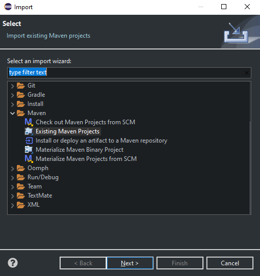
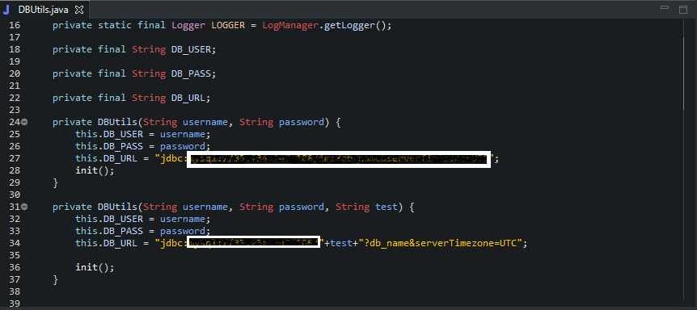
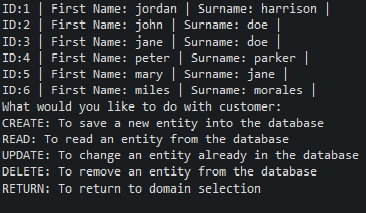
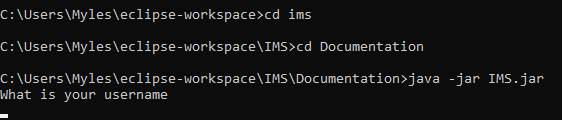

Coverage: 34%
# Project Title

One Paragraph of project description goes here
=======
Test Coverage: 90.85%
# Project Title

This is an Information Management System which is designed to Online Store Database containing customer information, item information and an orders table housing the orders customers make. The user of the application is able to assign orders to customers and add items to orders as well as remove or edit information about a customer item or orders.

## Getting Started

These instructions will get you a copy of the project up and running on your local machine for development and testing purposes. See deployment for notes on how to deploy the project on a live system.

### Prerequisites

What things you need to install the software and how to install them

```
Give examples
=======

### Prerequisites

What things you need to install the software and how to install them
1. Have Java 14 installed on your PC.
2. Have a local MySQL server running on your PC.
3. Have an IDE of your choice installed.
5. Have Maven installed on your PC.
6. Git Installed on your PC.


```
java -version
JDK Version 14.0.2" YYYY-MM--DD

```

### Installing

1. Git Bash into your target folder

2. Git Clone https://github.com/MylesBrathQA/QAProjectOne_IMS.git

```
git Clone https://github.com/MylesBrathQA/QAProjectOne_IMS.git
```
3. Open Existing Maven Project in IDE of your choice.

<p align="center">
  
</p>

4. Select folder

5. Open src/main/java/utils/DBUtils.java

<p align="center">
  
</p>

6. Ensure DB_URL to match your local MySQL Server address

```
DB_URL = jdbc:mysql://localhost.3306/ims
```

7. Run Java Application from src/main/java/Runner.java

8. Enter Username and Password for database

9. Type Customer, Read for output of current customers in Database (Can be changed by changing src/main/resources/sql-data.sql)

<p align="center">
	
</p>

### Running Application

1. Git Bash into your target folder

2. Git Clone https://github.com/MylesBrathQA/QAProjectOne_IMS.git

```
git Clone https://github.com/MylesBrathQA/QAProjectOne_IMS.git
```

3. Open your CLI/Terminal.

4. Navigate to the Documentations folder

5. Run following command

```
java -jar IMS.jar
```
<p align="center">
  
</p>


## Test

Explain how to run the automated tests for this system. Break down into which tests and what they do

### Unit Tests 

The Unit Test are split into two sections
1. DAO Test (Database Accessor Object Test)
2. Controller Test

#### 1. Unit Test:
Ensure that when app is live the test Database is completely seperate from the live database

##### Running the Test
1. Ensure that DB_URL for overloaded constructor that passes three parameters  is as follows 
```
	private DBUtils(String username, String password, String test) {
		this.DB_USER = username;
		this.DB_PASS = password;
		this.DB_URL = "jdbc:mysql://35.234.147.106/"+test+"?db_name&serverTimezone=UTC";

		init();
	}
```

2. Ensure that the DBUtils.connect method inside the init() method called passes 3 variables
```
@BeforeClass
	public static void init() {
		DBUtils.connect("root", "root", "testims");
	}
```
3. Run Coverage as JUnit Test

##### Example Code

This is example from ItemDAOTest.java this test updates an item from the test database and if this occurs then the test is passed

```
	@Test
	public void testUpdate() {
		Item expected = new Item(1l, "Test", 20l);
		
		assertEquals(expected, itemDAO.update(expected));
	}
```
#### 2. Controller Test

The Controller acts as the guide for the user allowing them to feed information into the DAO making the interaction with the database as smooth as possible between the user and the database

The test makes use of Mockito to mimic what the DAO would return when it is called and also mimics a users input to see if the code would respond as necessary thus the test code should only be change if the developer makes changes to how the controller works


1. Run Coverage as JUnit Test

## Deployment

Add additional notes about how to deploy this on a live system

## Built With

* [Maven](https://maven.apache.org/) - Dependency Management

## Versioning

We use [SemVer](http://semver.org/) for versioning.

## Authors

* **Chris Perrins** - *Initial work* - [christophperrins](https://github.com/christophperrins)
* **Myles Brathwaite** - *Version 1 of working IMS System* [MylesBrathwaite](https://github.com/MylesBrathQA)

## License

This project is licensed under the MIT license - see the [LICENSE.md](LICENSE.md) file for details 

*For help in [Choosing a license](https://choosealicense.com/)*

## Acknowledgments

* Piers Barber for the Price calculation method for Orders
* QA Consulting Academy

